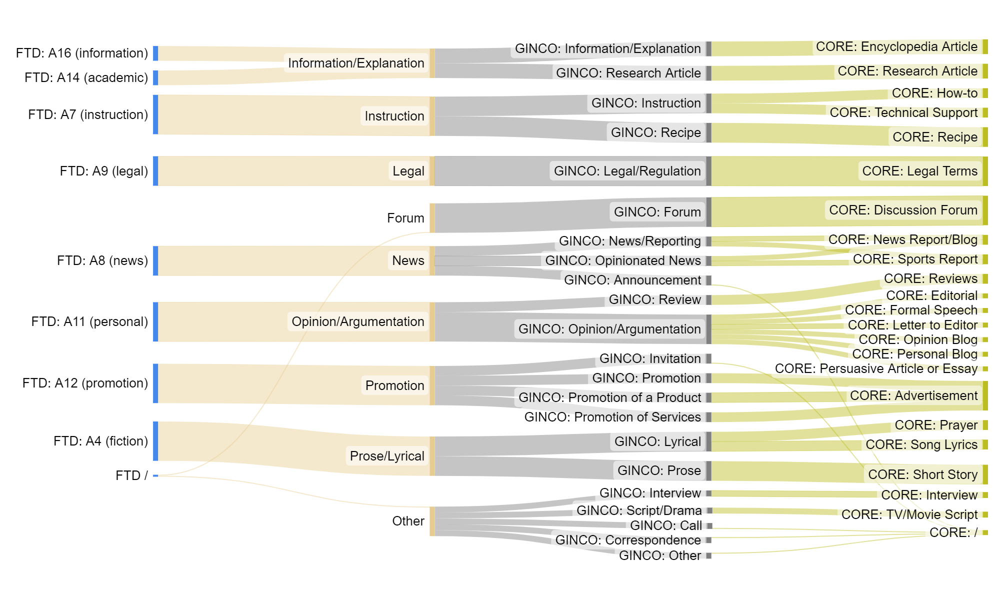

The purpose of this annotation task is to assign genre categories to a web corpus in order to determine their distribution in the corpus, and to allow the corpus’ users to create and analyze subcorpora limited to a particular genre. For this purpose, we will annotate genre categories which are recognizable by users of the corpus, and which are characterized by concrete features so that they should be predictable by a machine algorithm and that the manually annotated examples can be used for training a genre classifier.

To go straight to the decision tree with detailed information on each genre, click [**here**](_genre_pages/Decision_Tree.md).

## Table of contents
* [What is genre?](#what-is-genre)
* [Not Suitable Texts](#not-suitable-texts)
* [Categories](#categories)
* [General Instructions](#general-instructions)
* [Decision Tree](#decision-tree)

## What is genre?

For the purpose of this research, we define a (text) genre as “essentially a document type based on purpose, form and content” . For example, a document of the News genre informs the reader (purpose), it is typically divided into a headline and paragraphs (form), and it presents something that happened, is happening or will happen (content).

It should be noted that the content is not the same as topic of the text. For instance, a content of a recipe is “food preparation”, denoted by some common words, such as “Preparation”, “Serves”, “Ingredients”, etc., whereas the topic is the specific food/meal, mentioned in the text, e. g., “carrots”. A text on carrots is not necessarily a recipe – it could be an informative text on their nutritional benefits, an instruction on how to grow them, a legal text that regulates their production, a promotion of a food product based on carrots, a review of the product, etc. Therefore, the topic should not influence the choice of a genre.

## Not Suitable Texts

The text should be technically suitable for the needs of this research, otherwise it should be discarded. In order to be annotated, the text must adhere to the following criteria:
* it is written in the target language of the annotation campaign (e.g., Slovenian, English, ...) and with correct alphabet (there should not be any issues with the OCR – other characters, such as “Ä” where Slovenian characters with diacritics (šumniki) should be)
* it is not a machine translation
* it contains sentences (with punctuation marks at the end)

Note that a text is discarded as a “machine translation” only if it is a translation of a poor quality (contains words that do not exist in the target language, wrong declensions of nouns, adjectives, adverbs and wrong conjugation of verbs, the text is incoherent, makes no sense). If you are unsure whether the text is a machine translation or written by a human, annotate it as if it were written by human.

## Categories

The categorization schema consists of 9 categories:
* Informative genres: Information/Explanation, News, Instruction, Legal
* Subjective non-promotional genre: Opinion/Argumentation
* Promotional genre: Promotion
* Genre consisting of a dialogue: Forum
* Literary genre: Prose/Lyrical
* Category Other 

The text could be marked as **Other** if it shows no recognizable features that are indicative of any category or if it seems to belong to a category that is not included in the schema, e.g., interviews, calls for papers, scripts and correspondence (letters).

As features of multiple genres can be intertwined in a text, **multiple labels** assigned to the same text are allowed. The secondary genre category should be the one which concrete features are less present in the text or which purpose can only be intuitively established. Please note that this applies to a single text in which the features of two genres are intertwined (e.g., an informational text which has some characteristics of a promotion as well), not to a text or multiple texts that consist of paragraphs of different genres (e. g., a document consisting of two texts: a news text which is followed by a forum; a text that starts with some information on the benefits of ingredients (Information/Explanation) and continues as a recipe (Instruction)).

Label description:

### Description of labels

|     Label               |     Description                                                                                                                                                                                                                                                                                                                                                                                                                                                                                                                                                    |     Examples                                                                                                                                                                                                                                  |
|-------------------------|--------------------------------------------------------------------------------------------------------------------------------------------------------------------------------------------------------------------------------------------------------------------------------------------------------------------------------------------------------------------------------------------------------------------------------------------------------------------------------------------------------------------------------------------------------------------|-----------------------------------------------------------------------------------------------------------------------------------------------------------------------------------------------------------------------------------------------|
| Information/Explanation | An objective text that describes   or presents an event, a person, a thing, a concept etc. Its main purpose is   to inform the reader about something.      Common features: objective/factual, explanation/definition of a concept (x   is …), enumeration.                                                                                                                                                                                                                                                                                                       | research article, encyclopedia article, informational blog, product   specification, course materials, general information, job description,   manual, horoscope, travel guide, glossaries, historical article, biographical   story/history. |
| Instruction             | An objective text which instructs   the readers on how to do something.      Common features: multiple steps/actions, chronological order, 1st person   plural or 2nd person, modality (must, have to, need to, can, etc.), adverbial   clauses of manner (in a way that), of condition (if), of time (after …).                                                                                                                                                                                                                                                   | how-to texts, recipes, technical support                                                                                                                                                                                                      |
| Legal                   | An objective formal text that   contains legal terms and is clearly structured. The name of the text type is   often included in the headline (contract, rules, amendment, general terms and   conditions, etc.).      Common features: objective/factual, legal terms, 3rd person.                                                                                                                                                                                                                                                                                | small print, software license, proclamation, terms and conditions,   contracts, law, copyright notices, university regulation                                                                                                                 |
| News                    | An objective or subjective text   which reports on an event recent at the time of writing or coming in the near   future.      Common features: adverbs/adverbial clauses of time and/or place (dates,   places), many proper nouns, direct or reported speech, past tense.                                                                                                                                                                                                                                                                                        | news report, sports report, travel blog, reportage, police report,   announcement                                                                                                                                                             |
| Opinion/Argumentation   | A subjective text in which the   authors convey their opinion or narrate their experience. It includes   promotion of an ideology and other non-commercial causes. This genre includes a subjective narration of a personal   experience as well.      Common features: adjectives/adverbs that convey opinion, words that convey   (un)certainty (certainly, surely), 1st person, exclamation marks.                                                | review, blog (personal blog, travel blog), editorial, advice, letter to   editor, persuasive article or essay, formal speech, pamphlet, political   propaganda, columns, political manifesto                                                  |
| Promotion               | A subjective text intended to   sell or promote an event, product, or service. It addresses the readers,   often trying to convince them to participate in something or buy something.   Common features: contains adjectives/adverbs that promote something   (high-quality, perfect, amazing), comparative and superlative forms of   adjectives and adverbs (the best, the greatest, the cheapest), addressing the   reader (usage of 2nd person), exclamation marks. | advertisement, promotion of a product (e-shops), promotion of an   accommodation, promotion of company's services, invitation to an event                                                                                                     |
| Forum                   | A text in which people discuss a   certain topic in form of comments.      Common features: multiple authors, informal language, subjective (the   writers express their opinions), written in 1st person.                                                                                                                                                                                                                                                                                                                                                         | discussion forum, reader/viewer responses, QA forum                                                                                                                                                                                           |
| Prose/Lyrical           | A literary text that   consists of paragraphs or verses. A literary text is deemed to have no other   practical purpose than to give pleasure to the reader. Often the author pays   attention to the aesthetic appearance of the text. It can be considered as   art.                                                                                                                                                                                                                                                                                     | lyrics, poem, prayer, joke, novel, short story                                                                                                                                                                                                |
| Other                   | A text that which does not fall   under any of other genre categories.                                                                                                                                                                                                                                                                                                                                                                                                                                                                                             |                                                                                                                                                                                                                                               |

### Mapping to the GINCO, FTD and CORE schemata

The X-GENRE categories can be mapped to the GINCO (Kuzman et al., 2022), CORE (Egbert et al., 2015) and FTD (Sharoff, 2018) schemata, which enables cross-lingual cross-dataset experiments with GINCO, FTD and CORE datasets.

The mapping is shown in the following figure:

For more information on the mapping across schemata, refer to the paper *[Automatic genre identification for robust enrichment of massive text collections: Investigation of classification methods in the era of large language models](https://www.mdpi.com/2504-4990/5/3/59)* (Kuzman et al., 2023).

(Egbert, Jesse, Douglas Biber, and Mark Davies. "Developing a bottom‐up, user‐based method of web register classification." Journal of the Association for Information Science and Technology 66.9 (2015): 1817-1831.

Kuzman, Taja, Peter Rupnik, and Nikola Ljubešić. "The GINCO Training Dataset for Web Genre Identification of Documents Out in the Wild." Proceedings of the Thirteenth Language Resources and Evaluation Conference. 2022.

Kuzman, Taja, Igor Mozetič, and Nikola Ljubešić. "Automatic genre identification for robust enrichment of massive text collections: Investigation of classification methods in the era of large language models." Machine Learning and Knowledge Extraction 5.3 (2023): 1149-1175.

Sharoff, Serge. "Functional text dimensions for the annotation of web corpora." Corpora 13.1 (2018): 65-95.)

## General Instructions
* First, check whether there is a very recognizable form or content based on which you can quickly assign the genre. Reading the complete text is not necessary, just read a couple of sentences from the beginning, middle and the end of the text. That should give you enough information to ascertain the purpose and the most prevalent features of the text.
* After you have familiarized yourself with the genre schema and the annotation process, the annotation should be rather quick – if you cannot quickly identify a genre of the text, we assume that such text will not be very useful for the machine learning. So if you cannot quickly recognize any genre, discard the text as Other. If you are in doubt because it seems to be a mixture of genres, check which concrete features are more prevalent to assign the main genre and assign a secondary genre as well.
* If the quick genre categorization does not apply, use the decision tree to assign the genre. When in doubt, refer to the Categories explained below the decision tree, which includes the most prominent features and examples of each category. If you are certain of the genre, you can skip the decision tree and choose the category from the list.
* When assigning a genre, always prioritize concrete features of the text on which the classifier can be trained over your intuition regarding the purpose of the text (as the classifier cannot assign genres based on intuition). For instance, you feel that a text about wine is Promotion, because you know it is located on a winemaker’s online shop and because there is a price tag next to it, but the text itself shows no concrete characteristics of Promotion (no subjective adjectives, no addressing the reader, etc.). However, it has concrete features of Information/Explanation (objective adjectives, enumeration, explanation of a concept …). Therefore, you should annotate this example as Information/Explanation (and annotate Promotion as the secondary genre).
* If you easily assign the genre of the text, there is no need to spend time thinking if a secondary category exists as well – this option is reserved for cases when you are considering two genres from the start.
* If you are not sure, do not hesitate to ask. If you refer to a particular text, include the document ID.
* Make breaks frequently. Trying to stay focused for a long time leads to mistakes.

## Decision Tree

To get familiar with the genres and the decision process that should be followed, start annotating using our [**decision tree**](_genre_pages/Decision_Tree.md).

By clicking on the genre category in the tree, you will be directed to a part of the page which presents genre categories by providing a short description, common features, and examples. Common features have been identified in a preliminary study and are meant to direct the annotator towards the most probable genre, as it was noticed that most of the texts include at least one of the features that are common of their assigned genre. However, that does not mean that a text should include all of the features in order to be assigned a certain genre.
